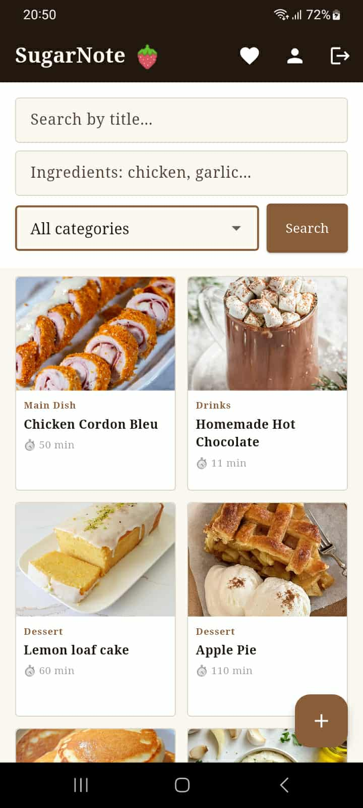
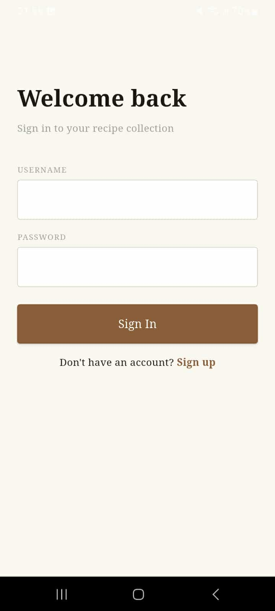

# SugarNote Mobile

A recipe manager mobile app built with Flutter.

## Features
- Browse and search recipes
- Filter by category, ingredients and cook time
- View recipe details with ingredients and instructions
- Create, edit and delete your own recipes
- Favorite recipes
- User profiles
- Image upload via Cloudinary

## Backend
This app connects to the SugarNote web backend hosted on Render.
Web app repository: https://github.com/squiiishyyy/SugarNote-web-app

## Getting Started
1. Clone the repo
2. Run `flutter pub get`
3. Run `flutter run`

## Screenshots

